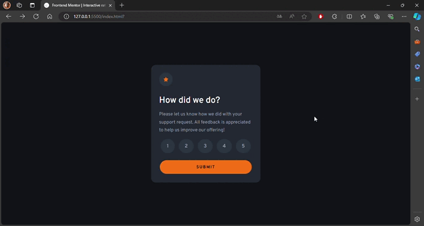

# Frontend Mentor - Interactive rating component solution

<div align="left">
  <a href="https://www.linkedin.com/in/danae-lescano-salvatierra" target="_blank">
    
  </a>
  <a href="https://lescano713.github.io/Interactive-Rating-Component/" target="_blank">
    
  </a>
  <a href="https://www.frontendmentor.io/profile/Lescano713" target="_blank">
    
  </a>
</div>


## Table of contents

- [Overview](#overview)
  - [The challenge](#the-challenge)
  - [Screenshot](#screenshot)
- [My process](#my-process)
  - [Built with](#built-with)
  - [What I learned](#what-i-learned)
  - [Continued development](#continued-development)


## Overview

### The challenge

Users should be able to:

- View the optimal layout for the app depending on their device's screen size
- See hover states for all interactive elements on the page
- Select and submit a number rating
- See the "Thank you" card state after submitting a rating

### Screenshot



## My process

### Built with

- Semantic HTML5 markup
- CSS custom properties
- Flexbox
- CSS Grid
- Mobile-first workflow


### What I learned

<p>I learned about using pseudo-selectors to apply styles and the importance of the `name` and `value` attributes in radio buttons.</p>

```html
<input type="radio" id="option1" name="option" value="1">
<label for="option1">1</label>

<input type="radio" id="option2" name="option" value="2">
<label for="option2">2</label>
```
```css
input[type="radio"]{
    display: none;
}
input[type="radio"]:checked + label{
    background-color: var(--Orange);
    color: var(--DarkBlue);
}

```
<p>I implemented a validation mechanism that requires the user to choose an option before proceeding. If no option is selected, an alert message is shown.</p>

```js
if (!optionSelected) {
        alert("Please choose an option");
    } else {
        raitingState(optionSelected.value)
        document.body.classList.add('hide');
    }
```


### Continued development

<b>Advanced CSS Techniques:</b>
<p>I want to explore more advanced pseudo-selectors and combinators. I also aim to learn about CSS Grid and Flexbox to handle more complex layouts.</p>

<b>JavaScript Enhancements:</b>
<p>I plan to practice handling different user inputs and validation scenarios. I want to refine my understanding of JavaScript events and form handling.</p>

<b>Accessibility Improvements:</b>
<p>I need to ensure that my forms and interactive elements are accessible to all users, including those using assistive technologies.</p>

<b>Responsive Design:</b>
<p>I’ll work on making my designs responsive to different screen sizes and devices.</p>
